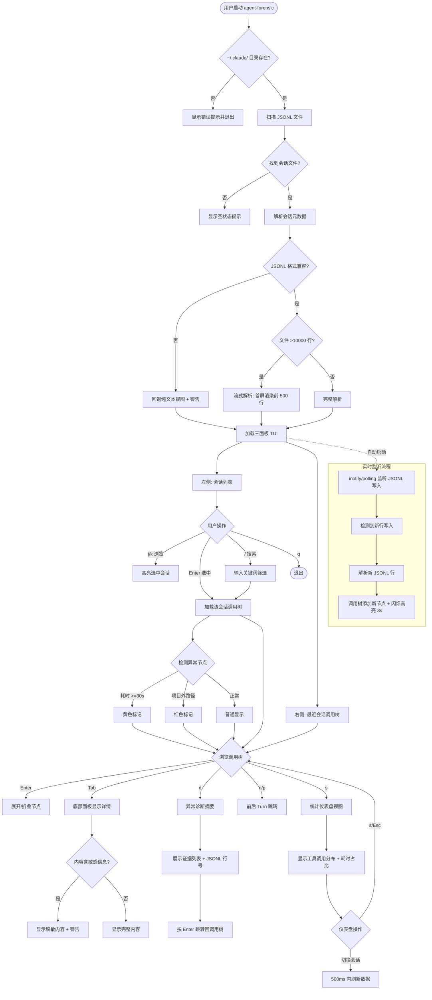

# Agent Forensic — PRD Spec

> PRD Spec: defines WHAT the feature is and why it exists.

## Background

### Why (Reason)

使用 Claude Code 等 AI coding agent 时，开发者无法直观观察 agent 的行为链路（工具调用、文件操作、子 agent 分派等），导致失控感和问题排查困难。现有工具（如 forge:forensic）仅支持事后文本报告，缺少实时可视化和交互式回放能力。

实际损失案例：
- agent 误删 `config/production.yml` 并重建错误版本，导致环境不可用 2 小时，排查耗时 35 分钟
- agent 在子 agent 会话执行非预期 `rm -rf`，排查耗时超过 1 小时
- Claude Code 权限持续扩大（文件写入、shell 执行、MCP 调用），每次扩展增加误操作影响面

### What (Target)

开发一个 lazygit 风格的终端 TUI 工具，提供调用树视图、事后回放、实时监听、统计仪表盘、异常标记和 AI 证据提取功能。数据来源为 `~/.claude/` 目录下的 JSONL 会话文件，纯观察模式不干预 agent 行为。

### Who (Users)

使用 Claude Code 的独立开发者——需要在终端环境中审计自己的 agent 会话行为、排查异常操作、回放历史决策过程的个人用户。

## Goals

| Goal | Metric | Notes |
|------|--------|-------|
| 加速异常定位 | 排查时间从 20-40 分钟降至 ≤2 分钟 | 通过调用树 + 异常标记 + 证据提取 |
| 行为可视化 | 展示 ≥3 层嵌套调用树（session → turn → tool call） | 替代手动翻阅 JSONL |
| 非侵入式观察 | 运行前后 `~/.claude/` 所有文件 SHA256 不变 | 纯只读，不发送信号 |

## Scope

### In Scope
- [ ] JSONL 解析引擎：解析 `~/.claude/` 下的 Claude Code 会话 JSONL 文件，提取结构化数据
- [ ] Session 列表：列出所有历史会话，支持按关键词搜索和筛选
- [ ] 调用树视图：树形展示 session → turn → tool call → sub-agent 嵌套关系
- [ ] 事后回放：加载历史会话，按时间轴浏览，展示每个步骤的耗时
- [ ] 实时监听：监听 JSONL 文件变化，实时更新当前会话视图
- [ ] 统计仪表盘：工具/Skill 调用次数、任务总耗时、各步骤耗时占比
- [ ] 异常标记：耗时过长步骤高亮 + 越权行为检测（访问项目目录外的文件）
  - **项目目录边界定义**：启动时通过 `git rev-parse --show-toplevel` 检测 git 仓库根目录作为项目目录；若不在 git 仓库内，则回退到当前工作目录（cwd）。工具参数中的路径经绝对路径规范化后与项目目录前缀比较，不在前缀范围内的标记为越权
- [ ] 规则化证据提取（Phase 1 / MVP）：选中异常会话 → 基于阈值规则自动提取关键证据 → 展示诊断摘要
- [ ] 键盘驱动的交互：lazygit 风格快捷键操作
- [ ] 国际化（i18n）：所有 UI 标签、提示文字、状态消息支持中文和英文切换；默认中文；通过快捷键或启动参数 `--lang en` 切换语言

### Out of Scope
- 控制能力（暂停/终止/注入指令给 agent）
- 多 agent 支持（Cursor、Aider 等，仅 Claude Code）
- Token 计数和费用追踪
- 自定义告警规则引擎
- 远程监控（SSH 等）
- Web UI
- AI 根因分析（Phase 2）

## Flow Description

### Business Flow Description

1. 用户启动 `agent-forensic`，工具扫描 `~/.claude/` 目录查找 JSONL 会话文件
2. 左侧面板加载全部历史会话列表（日期、工具调用数、总耗时）
3. 右侧面板默认加载最近会话的调用树（session → turn → tool call 层级）
4. 用户在左侧面板用 `j`/`k` 浏览会话，按 `Enter` 选中 → 右侧加载对应调用树
5. 用户按 `/` 输入关键词搜索会话，按 `Enter` 选中搜索结果
6. 用户在调用树中浏览节点，异常节点（耗时 ≥30s 标黄，项目目录外访问标红）自动可见
7. 用户选中节点按 `Tab` → 底部面板显示完整工具参数和输出
8. 用户按 `d` → 弹出异常诊断摘要，列出该会话所有标记异常点
9. 异常诊断中每条证据标注 JSONL 行号，用户按 `Enter` 可跳转回调用树对应节点

**异常情况处理：**
- JSONL 格式不兼容 → 解析器显示警告，回退纯文本视图
- 会话文件过大（>10000 行）→ 流式解析，首屏只渲染前 500 行
- `~/.claude/` 目录不存在 → 显示错误提示并退出
- 无会话文件 → 显示空状态提示

### Business Flow Diagram

### Data Flow Description

| Data Flow ID | Source | Target | Data Content | Transport | Frequency | Format | Notes |
|---|---|---|---|---|---|---|---|
| DF001 | `~/.claude/*.jsonl` | 解析引擎 | JSONL 会话记录（turn、tool call、thinking） | 文件读取 | 启动时 + 实时监听 | JSONL | 只读 |
| DF002 | 文件系统 inotify/polling | 实时监听模块 | 文件变更事件 | OS 事件 | 持续 | Event | 监听新写入行 |

## Functional Specs

> UI 功能规格详见 [prd-ui-functions.md](./prd-ui-functions.md)。

### Related Changes

无。这是独立工具，不修改任何现有模块。

## Other Notes

### Performance Requirements
- 首屏渲染：<5000 行 JSONL 在 3 秒内，5000-20000 行在 5 秒内
- 搜索响应：500ms 内返回结果
- 快捷键响应：<100ms
- 实时监听延迟：JSONL 写入后 2 秒内显示新节点
- 大文件渲染：虚拟滚动，帧率 ≥30fps

### Data Requirements
- 数据源：`~/.claude/` 目录下的 JSONL 文件，只读访问
- 敏感内容处理：匹配 `API_KEY|SECRET|TOKEN|PASSWORD`（大小写不敏感）自动脱敏为 `***`
- 默认截断参数至 200 字符，按 Enter 展开全文

### Monitoring Requirements
- 不适用（本地 CLI 工具，无服务端监控）

### i18n Requirements
- 支持中文（默认）和英文两种语言
- 所有 UI 标签、状态提示、错误消息必须可翻译
- 启动参数 `--lang zh|en` 或快捷键切换语言
- 语言切换即时生效，无需重启

### Security Requirements
- 纯本地处理，不传输数据到外部
- 运行前后 `~/.claude/` 目录所有文件 SHA256 哈希一致
- 不向 Claude Code 进程发送任何信号
- 敏感内容自动脱敏，展开时显示警告提示

---

## Quality Checklist

- [x] Is the requirement title accurate and descriptive
- [x] Does the background include all three elements: reason, target, users
- [x] Are the goals quantified
- [x] Is the flow description complete
- [x] Does the business flow diagram exist (Mermaid format)
- [x] Is prd-ui-functions.md referenced and UI specs complete
- [x] Are related changes thoroughly analyzed
- [x] Are non-functional requirements considered (performance / data / monitoring / security)
- [x] Are all tables filled completely
- [x] Is there any ambiguous or vague wording
- [x] Is the spec actionable and verifiable
