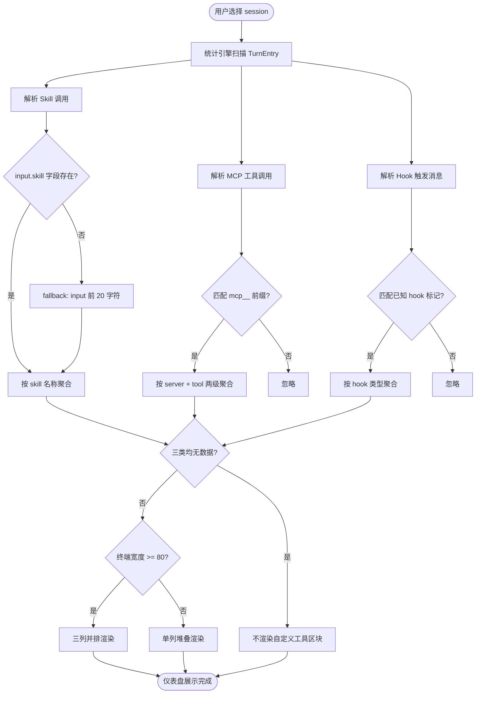

# 仪表盘自定义工具统计区块 — PRD Spec

> PRD Spec: defines WHAT the feature is and why it exists.

## Background

### Why (Reason)

当前统计仪表盘只展示内置工具（Bash、Read、Write 等）的调用次数和耗时。用户自定义扩展——Skill、MCP 工具、Hook——要么被混入工具列表无法区分，要么完全缺失。以一次典型 session 为例，Skill 调用 8 次、MCP 工具调用 12 次，合计占工具调用总量约 40%，但仪表盘对这部分信息完全不可见。

具体缺失：
- `Skill` 工具只显示总次数，看不出具体调用了哪些 skill
- `mcp__ones-mcp__addIssueComment` 等 MCP 工具被当作普通工具混在列表里，无法按服务分组
- Hook 触发次数完全没有统计，无法发现 PostToolUse 意外循环触发等异常

### What (Target)

在仪表盘现有「工具调用统计」区块下方，新增「自定义工具」独立区块，分三列展示 Skill 调用明细、MCP 工具按服务分组统计、Hook 触发次数。

### Who (Users)

使用 agent-forensic 复盘 Claude Code session 的开发者，尤其是：
- 使用了 forge 插件体系（skill 调用频繁）的用户
- 集成了多个 MCP 服务的用户
- 配置了自定义 hook 的用户

## Goals

| Goal | Metric | Notes |
|------|--------|-------|
| 自定义扩展使用情况可见 | 仪表盘展示 Skill / MCP / Hook 三类统计，覆盖率 100% | 有数据时必须展示，无数据时不渲染 |
| 异常触发可发现 | 仪表盘直接展示各 hook 类型的绝对触发次数（精确到个位），用户无需额外工具即可读取任意 session 的 hook 触发量 | 数字本身即为可验证指标；无需阈值判断或额外高亮 |
| MCP 使用分布可读 | 按 server 分组后，单个 server 下工具数 ≤ 5 时全部展示，> 5 时截断并注明 | 避免列表过长 |

## Scope

### In Scope
- [ ] 解析 `Skill` 工具调用的 `input` 字段，提取 skill 名称，按名称聚合计数
- [ ] 识别 `mcp__<server>__<tool>` 格式工具名，按 server 分组，展示 server 总次数及每个工具次数
- [ ] 从 JSONL 系统消息中识别 hook 触发事件（PreToolUse、PostToolUse、Stop、user-prompt-submit-hook），统计各类型触发次数
- [ ] 仪表盘新增「自定义工具」区块，三列并排布局
- [ ] 终端宽度 < 80 列时自动切换为单列堆叠布局
- [ ] 某列无数据时显示 `(none)`，三列均无数据时整个区块不渲染
- [ ] i18n 支持（zh/en）

### Out of Scope
- Hook 的耗时统计（JSONL 中无可靠时间戳）
- Skill 的耗时统计（Skill 工具本身无 duration）
- 点击展开/折叠交互
- 历史 session 对比
- 非 `mcp__` 前缀的 MCP 工具识别

## Flow Description

### Business Flow Description

用户打开 agent-forensic 并选择一个 session 后，仪表盘面板自动渲染。渲染时：

1. 统计引擎扫描 session 所有 TurnEntry，识别三类自定义工具调用
2. 若三类均无数据，「自定义工具」区块不渲染
3. 若有任意一类有数据，区块渲染，无数据的列显示 `(none)`
4. 终端宽度检测：≥ 80 列时三列并排，< 80 列时单列堆叠

Skill 解析：读取 `Skill` 工具调用的 `input` JSON，提取 `skill` 字段值；解析失败时 fallback 到 input 前 20 字符。

MCP 解析：工具名匹配 `mcp__<server>__<tool>` 正则，提取 server 和 tool 名称；不匹配的工具名忽略，区块标题注明「仅统计 mcp__ 前缀工具」。

Hook 解析：扫描 JSONL 中 role=user 的系统消息，匹配已知 hook 触发标记（`<user-prompt-submit-hook>`、`PreToolUse`、`PostToolUse`、`Stop`）。

### Business Flow Diagram

### Data Flow Description

本功能为单系统只读展示，无跨系统数据流，跳过此节。

## Functional Specs

> UI 功能规格详见 [prd-ui-functions.md](./prd-ui-functions.md)。

### Related Changes

| # | Project | Module | Change Point | Updated Logic |
|------|----------|----------|------------|----------------|
| 1 | agent-forensic | stats | SessionStats 结构体 | 新增 SkillCounts、MCPServerCounts、HookCounts 字段 |
| 2 | agent-forensic | stats | CalculateStats() | 新增三类自定义工具的聚合逻辑 |
| 3 | agent-forensic | dashboard | renderDashboard() | 新增「自定义工具」区块渲染 |
| 4 | agent-forensic | i18n | zh.yaml / en.yaml | 新增区块标题和列标题的翻译键 |

## Other Notes

### Performance Requirements
- Response time: 与现有仪表盘渲染时间一致，新增解析不应使渲染延迟超过 50ms
- Concurrency: 不涉及
- Data storage: 不涉及持久化，纯内存计算
- Compatibility: 终端宽度自适应（≥ 80 列三列，< 80 列单列）

### Data Requirements
- Data tracking: 不涉及
- Data initialization: 不涉及
- Data migration: 不涉及

### Monitoring Requirements
- 不涉及运行时监控；解析失败时 fallback 静默处理，不报错

### Security Requirements
- 不涉及网络传输、存储加密或用户输入
- Skill input 内容仅用于提取名称，不展示原始 JSON

---

## Quality Checklist

- [x] 需求标题准确描述功能
- [x] Background 包含原因、目标、用户三要素
- [x] Goals 已量化
- [x] 流程描述完整
- [x] 业务流程图存在（Mermaid 格式）
- [x] 引用了 prd-ui-functions.md
- [x] Related Changes 已分析
- [x] 非功能需求已考虑（性能 / 数据 / 监控 / 安全）
- [x] 无模糊措辞
- [x] 规格可操作、可验证
