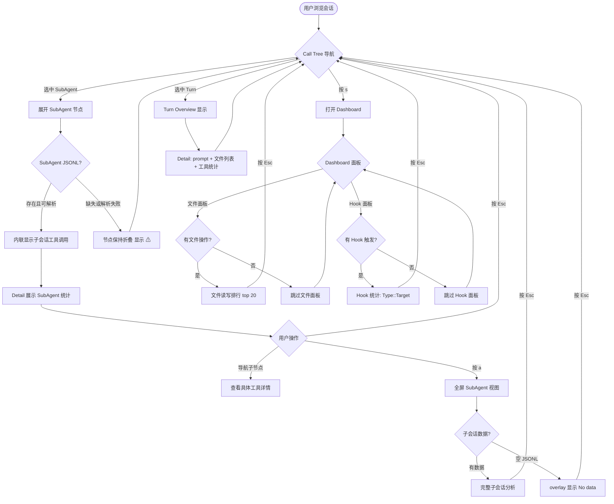

# Deep Drill Analytics — PRD Spec

> PRD Spec: defines WHAT the feature is and why it exists.

## Background

### Why (Reason)

Agent-forensic 当前只提供浅层总览（Dashboard 柱状图）和单条工具调用详情（Detail 面板），缺少从宏观到微观的下钻能力。过去 30 天本项目的 Claude Code 会话数据显示：单次会话平均 47 个工具调用，38% 的会话包含 subagent（平均 3.2 个子会话），JSONL 文件平均 2.4 MB、最大 18 MB。在这些复杂会话中，用户需逐行扫描 Call Tree 来定位问题，平均耗时超过 5 分钟才能回答"agent 在哪些文件上浪费了时间"。

### What (Target)

在现有 Call Tree / Detail / Dashboard 三层结构上增加下钻分析能力：
- SubAgent 节点可展开查看内部行为
- 文件读写统计覆盖会话/Turn/SubAgent 三级
- Hook 按 `类型::目标` 精细区分并展示时序分布
- 后续迭代增加 Turn 效率、重复检测、思考链可视化、成本与成功率分析

### Who (Users)

**开发者**：使用 Claude Code 进行日常开发的工程师。需要回溯 agent 会话行为，定位"agent 在哪里浪费时间"和"agent 是否在做无用功"。

## Goals

| Goal | Metric | Notes |
|------|--------|-------|
| 定位 SubAgent 行为 | 选中 SubAgent 后 3 秒内展示完整工具调用列表和文件操作 | 当前无法查看 SubAgent 内部行为 |
| 文件操作可视化 | 会话级文件读写排行展示 top 20 文件 | 当前无文件级统计 |
| Hook 精细化分析 | 区分同类型 Hook 的不同目标命令 | 当前仅按类型聚合 |
| 提升问题定位效率 | 从 5 分钟降至 30 秒内定位关键行为 | 基于现有使用数据的估算 |

## Scope

### In Scope — Phase 1 (MVP)

- [ ] P1-1: SubAgent Drill-down — Call Tree 内联展开 + 全屏分析视图
- [ ] P1-2: File Read/Write Tracking — 会话/Turn/SubAgent 三级文件操作统计
- [ ] P1-3: Hook Analysis Enhancement — `HookType::TargetCommand` 标识 + 时序分布

### In Scope — Phase 2 (后续迭代)

- [ ] P2-1: Turn Efficiency Analysis — 思考/执行/空闲时间占比
- [ ] P2-2: Repeat Operation Detection — 重复文件读写、命令重试、循环模式检测
- [ ] P2-3: Thinking Chain Visualization — 思考链时间线 + 策略变化点
- [ ] P2-4: Cost & Success Rate — 工具成功率、重试次数、P50/P95 耗时

### Out of Scope

- Token 用量统计（JSONL 中不一定包含 token 数据）
- 跨会话对比分析
- 网络请求追踪
- 导出报告为文件（PDF/HTML）
- 自定义分析规则/插件
- Bash 工具内部的文件操作追踪（管道、重定向）

## Flow Description

### Business Flow Description

用户在 agent-forensic 中浏览会话时的下钻分析流程：

**主线流程（SubAgent 下钻）：**
1. 用户在 Call Tree 中选中一个 SubAgent 节点
2. 按 Enter 展开该节点，Call Tree 内联显示子会话的工具调用树
3. Detail 面板同步切换为 SubAgent 统计视图，展示工具调用次数、文件读写列表、耗时分布
4. 用户可继续在子会话树中导航，选中具体工具调用查看详情
5. 按 `a` 键打开 SubAgent 全屏分析视图，查看完整的子会话分析

**主线流程（文件/Hook 分析）：**
1. 用户在主界面按 `s` 打开 Dashboard
2. Dashboard 新增文件读写排行面板和 Hook 分析面板
3. 用户浏览文件操作排行（按文件路径聚合，top 20）
4. 用户浏览 Hook 触发统计（按 `HookType::TargetCommand` 分组）
5. 按 `s` 返回主界面

### Business Flow Diagram

## Functional Specs

> UI 功能规格详见 [prd-ui-functions.md](./prd-ui-functions.md)。

### Related Changes

| # | Module | Change Point | Updated Logic |
|------|--------|------------|----------------|
| 1 | parser/jsonl | 加载 `subagents/` 目录 | 新增 SubAgent 会话解析，不再跳过 subagents 目录 |
| 2 | stats/stats | Hook 解析增强 | `parseHookMarker` 增加 target command 提取 |
| 3 | stats/stats | 文件操作提取 | 新增 Read/Write/Edit 工具的 `file_path` 聚合 |
| 4 | model/calltree | SubAgent 节点展开 | 支持内联展开子会话工具调用树 |
| 5 | model/detail | SubAgent 统计视图 | 选中 SubAgent 时展示统计摘要 |
| 6 | model/dashboard | 新增分析面板 | 文件排行 + Hook 分析面板 |

## Other Notes

### Performance Requirements
- SubAgent 会话懒加载：按需解析，不在会话列表加载时一并解析
- 大会话降级：>50 个子会话时自动降级为摘要模式；>10MB JSONL 只加载索引头
- UI 响应：Call Tree 滚动渲染延迟 < 200ms
- 终端兼容：所有功能在终端宽度 >= 120 列时可用

### Data Requirements
- 数据来源：`~/.claude/projects/*/subagents/*.jsonl` 文件
- 文件路径提取：Read/Write/Edit 工具的 `input.file_path` 字段
- Hook 目标提取：Hook output 文本中的目标工具名或命令
- 数据仅在本地解析，不涉及网络传输

### Monitoring Requirements
- 无需额外监控（本地 TUI 工具）

### Security Requirements
- 敏感数据脱敏：沿用现有 sanitizer（API key、token、password 掩码）
- 无网络请求：纯本地文件解析
