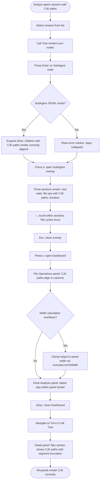
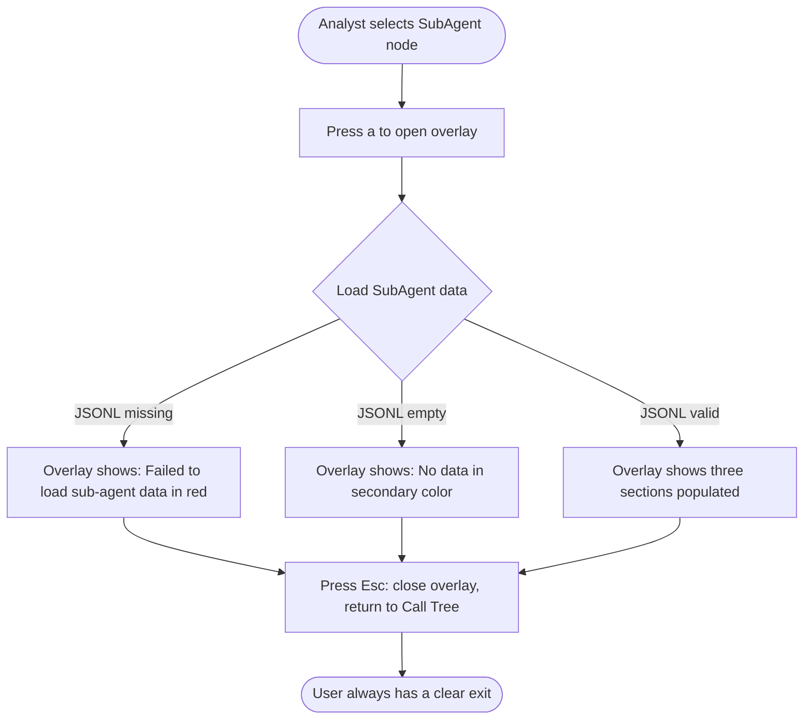
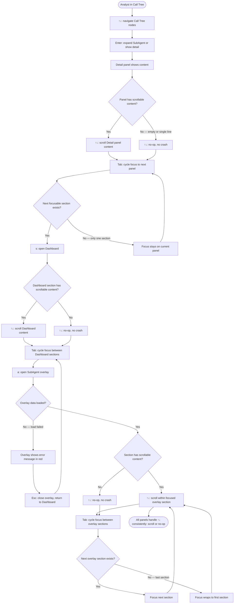
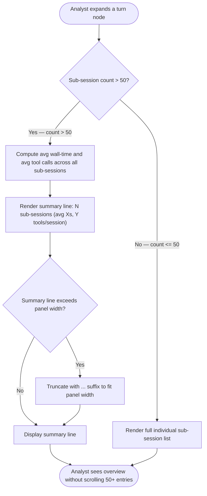

# Deep Drill Quality Remediation — PRD Spec

> PRD Spec: defines WHAT the feature is and why it exists.

## Background

### Why (Reason)

The `deep-drill-analytics` feature (PR #5) was merged after an extended development phase where the agent did not consistently follow project conventions. A post-merge audit identified 16 findings: 5 critical bugs (CJK text corruption, stuck loading state, panel overflow), 6 high-severity convention violations (duplicate code, hardcoded strings, missing key bindings), and 5 medium-severity spec inconsistencies across PRD, UI design, and tech design documents.

### What (Target)

Fix all audit findings to deliver a consistent, intuitive user experience across every panel that deep-drill-analytics touches — Call Tree (SubAgent expand), Detail panel (file ops, stats view), Dashboard (file ops bar chart, hook analysis), and SubAgent overlay (tool stats, file ops, hooks).

### Who (Users)

**Session Analyst (Developer)** — A developer using the forensic TUI tool to analyze agent session transcripts. They navigate panels with keyboard shortcuts, inspect file operations and hook timelines, and drill into SubAgent sessions. They expect consistent arrow key navigation (`↑`/`↓`), clean text rendering regardless of file path language, and consistent interaction patterns across all panels.

## Goals

| Goal | Metric | Notes |
|------|--------|-------|
| CJK rendering correctness | Zero corrupted UTF-8 output in golden tests with CJK test data | Covers all panels displaying file paths or tool names |
| Navigation consistency | `↑`/`↓` arrow keys work in every scrollable panel | Call Tree, Detail, Dashboard, SubAgent overlay all use consistent arrow key navigation |
| No stuck states | Zero permanent "Loading..." states; all error paths show recoverable error message | SubAgent overlay never traps user |
| Text overflow eliminated | Zero lines exceeding panel width in golden tests at 80x24 and 140x40 | All panels clamp content to allocated width |
| Spec consistency | All 3 design docs state same terminal min-width, path truncation format, and overlay title source | PRD, UI design, tech design fully aligned |
| Code architecture | Zero duplicate functions between model/ and stats/ packages | Single source of truth for computation |

## Scope

### In Scope

- [ ] P0-1: Fix CJK width in `truncatePath` — replace `len()` with `runewidth.StringWidth()` + segment-based truncation
- [ ] P0-2: Fix CJK width in `dashboard_fileops.go` — replace `len()` with `runewidth.StringWidth()` for path padding
- [ ] P0-3: Fix CJK width in `dashboard.go` — replace `len()` with `runewidth.StringWidth()` for tool name labels
- [ ] P0-4: Fix dead `SubAgentLoadMsg` path — remove unused type, ensure all error paths show error state (not stuck loading)
- [ ] P0-5: Fix `renderHookStatsSection` overflow — implement width-aware truncation at render exit
- [ ] P1-6: Fix `wrapText`/`truncateStr` in hook panel — use `runewidth.StringWidth()` instead of rune count
- [ ] P1-7: Extract duplicate code from `app.go` to `stats/stats.go` — 5 functions
- [ ] P1-8: Create accessor functions for tool names — `IsReadTool`, `IsEditTool`, `IsFileTool` in `parser/`
- [ ] P1-9: Standardize all panels on `↑`/`↓` arrow key navigation, remove redundant `j`/`k` bindings
- [ ] P1-10: Implement `truncatePathBySegment()` utility — shared segment-based path truncation
- [ ] P1-11: Enforce `maxLines` in overlay hook section — add scroll state with scrollbar
- [ ] P2-12: Unify terminal min-width to 80 columns across all design docs
- [ ] P2-13: Add `Command` field to SubAgent overlay title
- [ ] P2-14: Standardize path truncation format in PRD UI functions
- [ ] P2-15: Define >50 sub-sessions summary mode behavior

### Developer Tasks (no user story — internal quality)

These 4 scope items are code-architecture and documentation fixes with no direct user-facing behavior. They are verified by code-level success criteria (grep checks, not UI tests):

- **P1-7** (extract duplicate code): Verified by "zero duplicate functions between `app.go` and `stats.go`" — Success Criterion 3
- **P1-8** (tool name accessors): Verified by "all hardcoded tool name strings replaced by accessor functions" — Success Criterion 4
- **P2-12** (terminal min-width): Verified by "all three documents state 80-column minimum" — Success Criterion 7
- **P2-14** (path truncation format): Verified by "path truncation references same utility" — Success Criterion 7. **Note:** This changes user-visible path rendering format, but the behavior is fully covered by Story 5 (segment-based truncation). P2-14 ensures the truncation utility is shared across all panels rather than implemented per-panel, so it is classified as a developer task for traceability purposes.

### Out of Scope

- Phase 2 features (efficiency analysis, repeat detection, thinking chain, success rate)
- Performance optimization (>10MB JSONL handling)
- New UI components or user-facing feature additions
- Emoji detection improvements
- Forge pipeline enforcement

## Flow Description

### Flow 1: CJK Session Rendering Verification

Analyst opens a session containing non-ASCII file paths and verifies correct rendering across all panels.

### Flow 2: SubAgent Overlay Error Recovery

Analyst attempts to open a SubAgent overlay when the JSONL is missing or corrupt; system shows a clear error instead of a stuck loading spinner.

### Flow 3: Consistent Navigation Across Panels

Analyst navigates between panels using a uniform set of keyboard shortcuts.

### Flow 4: Sub-Sessions Summary Mode

Analyst expands a turn with many sub-sessions; system decides between full list and summary line based on count threshold.

## Functional Specs

> UI function specifications: [prd-ui-functions.md](./prd-ui-functions.md)

### Related Changes

| # | Module | Change Point | Updated Behavior |
|---|--------|-------------|-----------------|
| 1 | All scrollable panels | Scroll key bindings | Standardize on `↑`/`↓` arrow keys; remove redundant `j`/`k` from Dashboard and Overlay |
| 2 | Dashboard File Ops | Path padding width | Replace `len()` with `runewidth.StringWidth()` |
| 3 | Dashboard Tool Stats | Label width calculation | Replace `len()` with `runewidth.StringWidth()` |
| 4 | Dashboard Hook Panel | Width parameter usage | `renderHookStatsSection` uses width param; `wrapText`/`truncateStr` use display width |
| 5 | SubAgent Overlay | Path truncation | Replace character-based with segment-based truncation |
| 6 | SubAgent Overlay | Hook section scroll | Add scroll state + scrollbar for >20 hook items |
| 7 | SubAgent Overlay | Loading error path | Remove dead async code; show error state on failure |
| 8 | SubAgent Overlay | Title display | Show actual command instead of generic label |
| 9 | Call Tree | Inline expand paths | Same truncation fix as overlay |
| 10 | Code architecture | `app.go` → `stats.go` | Extract 5 duplicate functions; add 3 accessor functions |

## Other Notes

### Performance Requirements

- Rendering latency per panel: < 16ms for sessions with up to 100 sub-agents
- Path truncation is O(segments) — no measurable impact on rendering
- Golden tests must pass within 5 seconds per test file

### Compatibility Requirements

| Terminal | Requirement |
|----------|------------|
| Windows Terminal | Golden tests must pass; CJK paths render correctly |
| iTerm2 | Golden tests must pass |
| Alacritty | Golden tests must pass |
| macOS Terminal.app | Visual spot-check (no automated test requirement) |

Minimum terminal size: 80 columns x 24 rows.

### Data Requirements

- All external content (file paths, tool names, hook labels) sanitized before rendering
- Width calculation uses Unicode display width (East Asian Width standard), not byte count or rune count
- Path truncation preserves file extension by dropping whole path segments from the left

---

## Quality Checklist

- [x] Requirement title is accurate and descriptive
- [x] Background includes all three elements: reason, target, users
- [x] Goals are quantified (zero corrupted output, zero duplicate functions, consistent min-width)
- [x] Flow description covers all affected interaction paths
- [x] Business flow diagrams exist (4 Mermaid flowcharts)
- [x] prd-ui-functions.md is referenced and UI specs complete
- [x] Related changes thoroughly analyzed (10 change points)
- [x] Non-functional requirements considered (performance, compatibility)
- [x] All tables filled completely
- [x] No ambiguous or vague wording
- [x] Spec is actionable and verifiable
